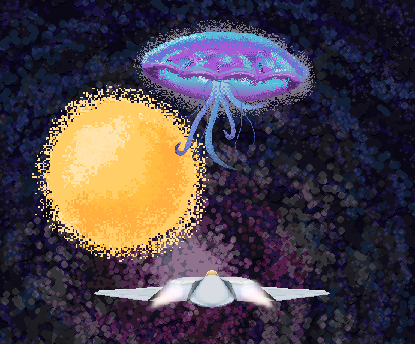

  <h2 style="margin: 10px 0 5px;">Controls</h2>
  

    WASD or Arrow Keys to move 
    ; or Space to fire weapon 
    Hold Enter during the intro to skip it
  

  
  
▶ Play

  <h1 style="font-size: 30px; margin-bottom: 20px;">Project Summary</h1>
  
 
    AstroSynchronous is a chaotic, bullet-hell style shoot 'em up with a twist: To deal damage, you must store and discharge energy by allowing your ship to get hit by bullets! Using this unique ability, you must destroy the threat that seeks to devour the Sun—the Cosmic Jellyfish—by absorbing and weaponizing the blasts of energy it fires at you.
  

  <ul style="padding-left: 0px;"></ul>
  
 
    This project was a collaborative effort between myself, 2 designers, 2 artists, and one sound designer. Over approximately one month, we followed a scrum workflow across 4 sprints to create a game built around the design verbs "connect" and "rush". Overall, the development of AstroSynchronous gave me valuable experience in working across disciplines and keeping a team aligned on a shared vision.     
  

  <h1 style="font-size: 30px; margin-bottom: 20px;">My Contributions</h1>
  

    During development, the bulk of my contributions consisted of the implementation of the game's visual effects---the ship's turning sprites, variable thruster animations, energy absorb effect, and ship explosion---as well as the design of the UI and main menu. Though I view myself as more of a designer/programmer, I also took on the role of a technical artist; as the intro, boss death, warning strip, win/lose, and transitionary animations between the main menu and game were all done by me through Unity's keyframe animation tool.   
  

  
  

  

    
    
<em>Intro animation</em>

  

  

    
    
<em>Boss death animation</em>

  

  

    I also designed and implemented a system that dynamically switches the boss's attack patterns. This required me to randomize which color bullet was active for that phase (and change their sprites/collisions based on that), what frequency (amount on screen) each of the three bullet types had, and update the UI accordingly to reflect the changes. Additionally, the system is modular---providing designers a straightforward pipeline for creating and implementing new attack patterns, as both systems live solely within the Inspector (no code required). 
  


public void ActivateRandomBulletPattern()
{
    Debug.Log("Bullet pattern started");
    if(TutorialActive.tutorialActive)
    {
        return;
    }

    if (activePattern != null)
    {
        activePattern.SetActive(false);
    }

    int randomIndex = UnityEngine.Random.Range(0, bulletPatterns.Length);
    activePattern = bulletPatterns[randomIndex];
    activePattern.SetActive(true);
    activePattern.GetComponent<BulletPattern>().UpdateSpawnerColors();
    activePattern.GetComponent<BulletPattern>().ActivateSpawners();
}


  ActivateRandomBulletPattern() selects from a list of designer-created patterns and cascades down through that pattern's bullet spawners to activate each, as well as update the color bullets they're firing.

  ough....

  

  <h1 style="font-size: 30px; margin-bottom: 20px;">What I Learned</h1>
  

