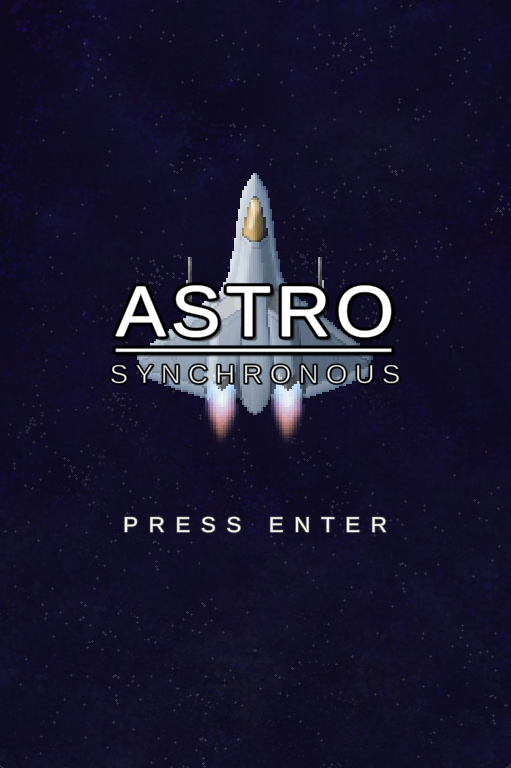

  <h2 style="margin: 10px 0 5px;">Controls</h2>
  

    WASD or Arrow Keys to move 
    ; or Space to fire weapon 
    Hold Enter during the intro to skip it
  

  
  
▶ Play

  <h1 style="font-size: 30px; margin-bottom: 20px;">Project Summary</h1>
  
 
    AstroSynchronous is a chaotic, bullet-hell style shoot 'em up with a twist: To deal damage, you must store and discharge energy by allowing your ship to get hit by bullets! Using this unique ability, you must destroy the threat that seeks to devour the Sun—the Cosmic Jellyfish—by absorbing and weaponizing the blasts of energy it fires at you.
  

  <ul style="padding-left: 0px;"></ul>
  
 
    This project was a collaborative effort between myself, 2 designers, 2 artists, and one sound designer. Over approximately one month, we followed a scrum workflow across 4 sprints to create a game built around the design verbs "connect" and "rush". Overall, the development of AstroSynchronous gave me valuable experience in working across disciplines and keeping a team aligned on a shared vision.     
  

  <h1 style="font-size: 30px; margin-bottom: 20px;">My Contributions</h1>
  

  

  <h1 style="font-size: 30px; margin-bottom: 20px;">What I Learned</h1>
  

