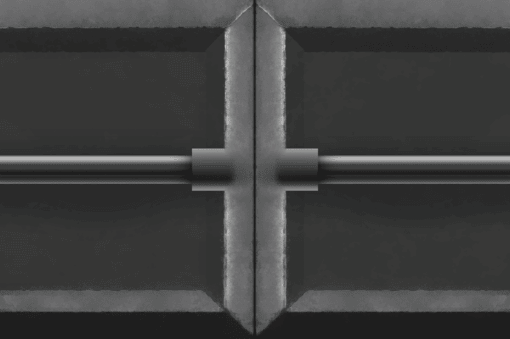

---
layout: project
title: CoinPunk
tagline: "<a href='https://itch.io/jam/coolmath-game-jam-2026'> The 20k Coolmath Game Jam</a> Submission"   
type: Team (7 members)
duration: "May 2026 → June 2026"
role: "Designer, Programmer"
itch: "https://seamus122405.itch.io/coin-punk"
selfLink: "./coinProject.html"
---   

  <h2 style="margin: 10px 0 5px;">Controls</h2>
  

    Left Click - Select and place components  
    Right Click - Deselect and remove components  
    Enter - Swap lever and component panels  
    R - Restart level (when in SIMULATION mode)
  

  
  
▶ Play

  <h1 style="font-size: 30px; margin-bottom: 20px;">Project Summary</h1>
  
 
    summary
  

  <h1 style="font-size: 30px; margin-bottom: 20px;">My Contributions</h1>
  

    contributions
  

  <h1 style="font-size: 30px; margin-bottom: 20px;">What I Learned</h1>
  

    learned
  

